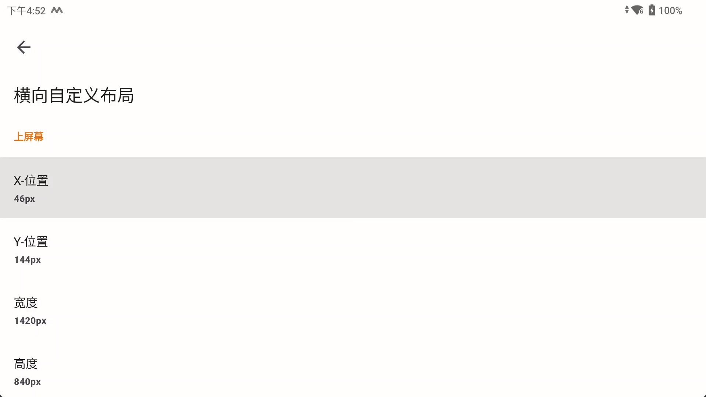
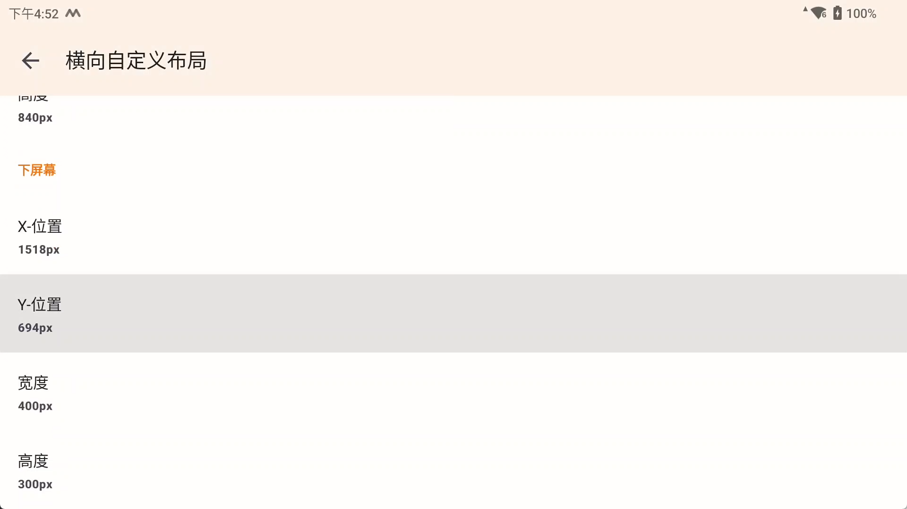

# AzaharPlus

包名 `io.github.lime3ds.android` 适配的是官方版

## 软件

[AzaharPlus](https://github.com/AzaharPlus/AzaharPlus)

## 功能

### 支持遮罩功能

适配遮罩功能，
请先查看[统一遮罩配置](Overlay.md)
下面是关于Azahar的特殊说明

#### Azahar的特殊说明

因为要支持Azahar的布局切换，Azahar配置目录下有一层布局文件夹，目前只支持了横向布局

|      文件夹      |  布局   |
|:-------------:|:-----:|
|   original    |  原始   |
| single_screen | 单个屏幕  |
| large_screen  |  大屏幕  |
|  side_screen  | 并排屏幕  |
| hybrid_screen | 混合式屏幕 |
| custom_layout | 自定义布局 |

在 `/storage/emulated/0/Android/data/io.github.lime3ds.android/files/overlay`
文件夹下有以上6个布局文件夹，在每个文件夹下按下面教程 [配置方法](Overlay.md#配置方法) 配置

在 `/storage/emulated/0/Android/data/io.github.lime3ds.android/files/overlay/custom_layout`
中的遮罩图，添加同名的ini文件,配置如下

```ini
LANDSCAPE_TOP_X=46
LANDSCAPE_TOP_Y=144
LANDSCAPE_TOP_WIDTH=1420
LANDSCAPE_TOP_HEIGHT=840
LANDSCAPE_BOTTOM_X=1518
LANDSCAPE_BOTTOM_Y=694
LANDSCAPE_BOTTOM_WIDTH=400
LANDSCAPE_BOTTOM_HEIGHT=300
```

对应软件内的自定义布局设置，这样实现多个自定义布局设置



