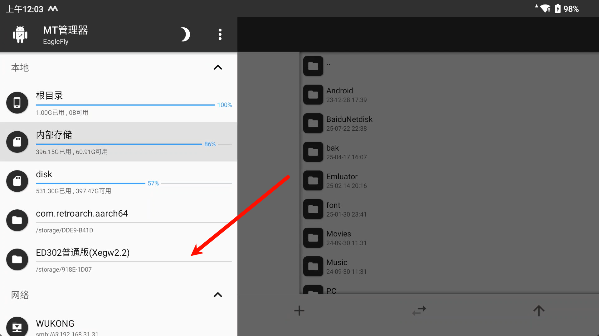

# Exagear

# Winlator

## 软件

这里适配的是静言思之-SZ整合版，包名为 com.ludashi.benchmara 的普通版，不支持安兔兔和鲁大师

[静言思之-SZ](https://www.bilibili.com/video/BV1hw411q7ZB/?spm_id_from=333.337.search-card.all.click&vd_source=ba89f3ba50fe2109cb8d5d11ab63c4ac)

[直装版](https://www.bilibili.com/video/BV1UQ4y1H73A/?spm_id_from=333.337.search-card.all.click&vd_source=ba89f3ba50fe2109cb8d5d11ab63c4ac)

## 功能

### 前端启动

启动程序并设置好快捷方式之后重启一次软件，模块会在 /storage/emulated/0/exagear/desktop/ 文件夹下生成启动快捷文件

#### ES-DE

前端启动适配，将程序导出文件，修改合适的中文名后移动到 ROMs/windows


`es_systems.xml``

```xml
<system>
    <name>windows</name>
    <fullname>Microsoft Windows</fullname>
    <path>%ROMPATH%/windows</path>
    <!-- 注意添加对应的后缀  -->
    <extension>.desktop .shortcut .egg</extension>
    <!-- Exagear 需要EmulatorPlus模块功能 -->
    <command label="Exagear (Standalone)">%EMULATOR_EXAGEAR% %ACTION%=android.intent.action.MAIN %ACTIVITY_CLEAR_TASK% %ACTIVITY_CLEAR_TOP% %DATA%=%ROM%</command>
    <!-- 省略其他模拟器配置 -->
</system>
```

`es_find_rules.xml`

```xml
<!-- Exagear -->
<emulator name="EXAGEAR">
    <rule type="androidpackage">
        <entry>com.ludashi.benchmara/com.ludashi.benchmara.activities.EDStartupActivity</entry>
    </rule>
</emulator>
```

##### Exagear名称修改
关于如何修改软件内的快捷方式名称

添加本地存储

点击这里

选择Exagear

旋转路径，使用文件夹


MT左侧便可以访问 Exagear的系统目录

注意选择容器编号

找到桌面路径

这里的同名desktop和lnk文件就是快捷方式文件,这里可以修改文件名称为中文

这里为啥要修改为中文名称呢，因为中文名便于遮罩独立配置，遮罩配置是使用这个文件名称来匹配遮罩的，[遮罩配置](Overlay.md)


修改 desktop 文件中的 Name，可以修改软件显示的快捷方式名称


#### Beacon

已适配，同上
`players_stable.json`

```json
{
  "name": "Windows",
  "shortname": "WIN",
  "extensions": "desktop",
  "launch": "am start -n com.ludashi.benchmara/.activities.EDStartupActivity -d {file_path}"
}
```

### 支持遮罩功能

适配遮罩功能，详情[遮罩配置](Overlay.md)