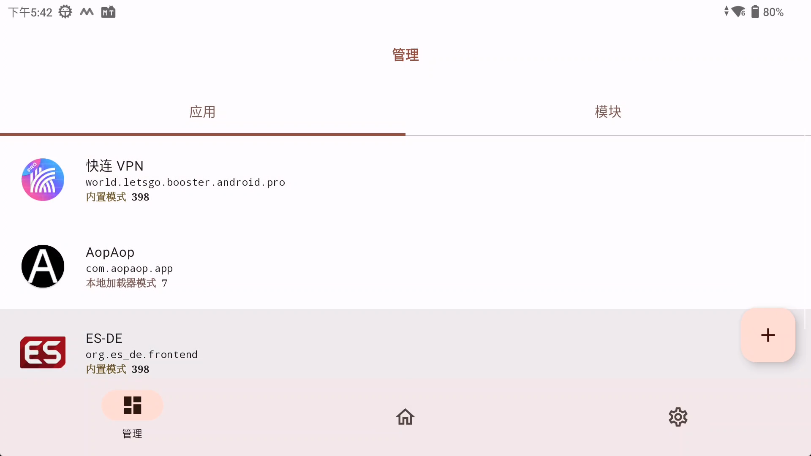
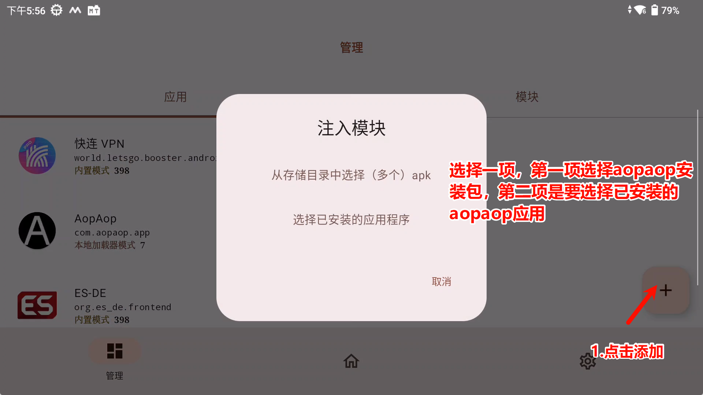
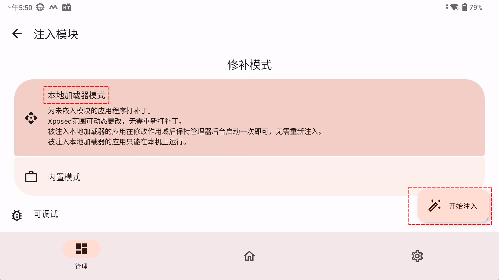
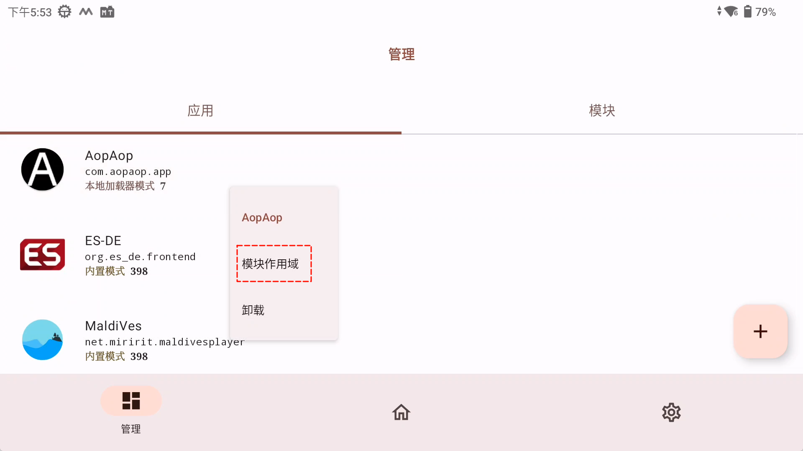
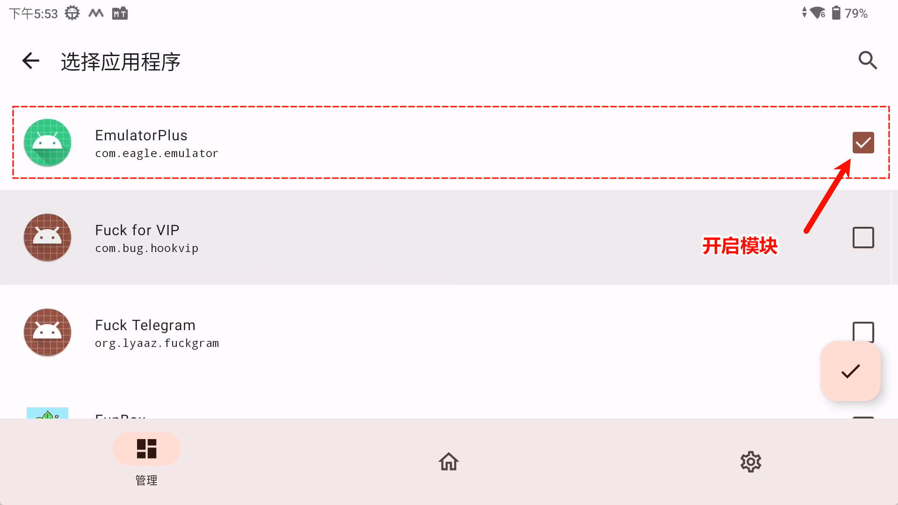
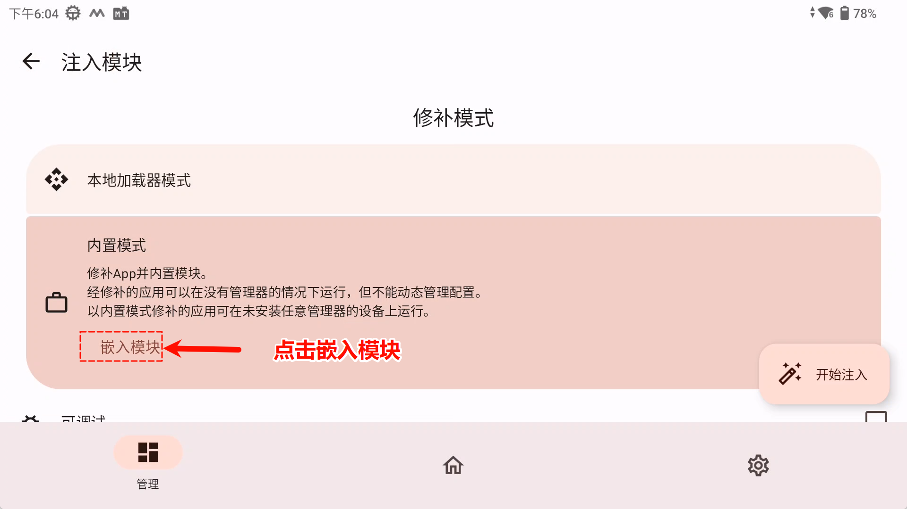
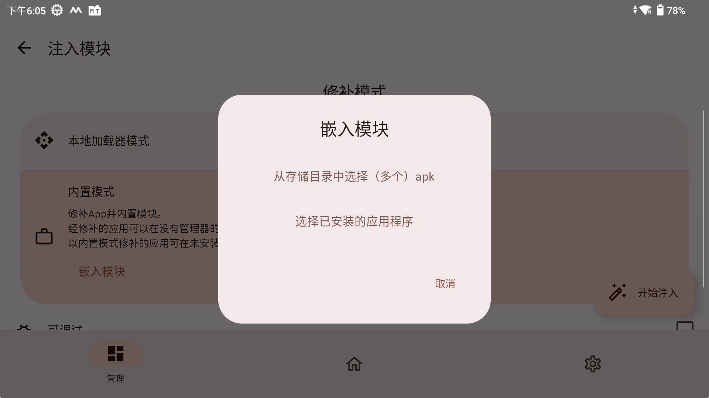
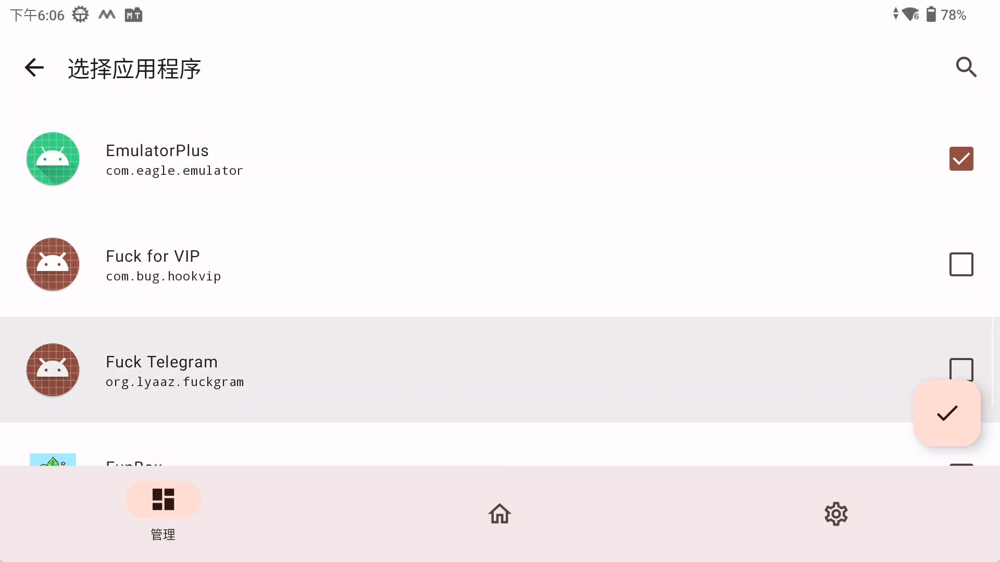

# 非Root方案

## 说明：非root方案并不保证一定成功，具体情况请自行测试

这里推荐使用 Opatch ，FPA ，Lspatch 三款框架

这里说明一下优缺点：
ONPatch，LSPatch 支持本地和内嵌两种模式，FPA只支持本地模式
ONPatch和FPA本地模式，不需要应用启动，LSPatch本地模式需要保持Lspatch应用一直启动

以成功概率来说
推荐 ONPatch本地

以内嵌优先推荐方案顺序为
LSPatch内嵌 > ONPatch内嵌 > ONPatch本地 > FPA本地
按这个顺序尝试，直到无bug

## Opatch

### 本地模式

这里以 AopAop 为例，（AopAop内嵌模式有bug）

添加安装包或应用

选择本地模式，注入后安装

选择安装应用模块作用域

开启 EmulatorPlus 模块

### 内嵌模式

添加安装包或应用

选择嵌入模块

这里和添加应用一样，不过这里选择 EmulatorPlus 安装包或已安装应用
注入后安装即可

该方案有一定的bug，不一定所有应用都适用，有bug时可尝试适用 LSPatch 嵌入试试 或 本地模式

