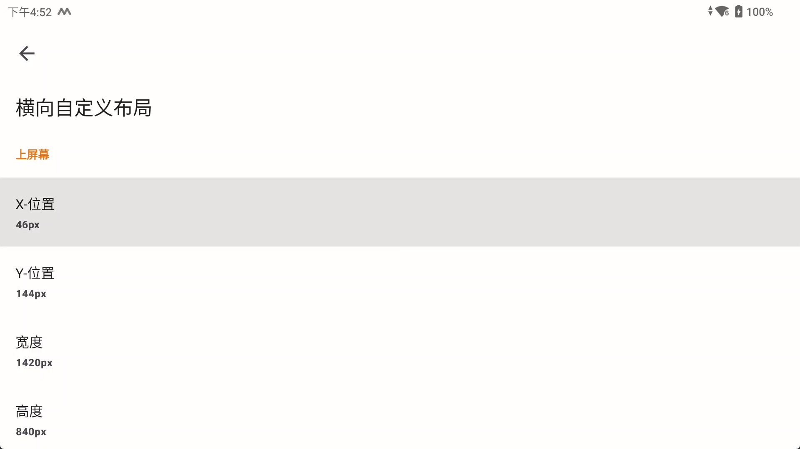
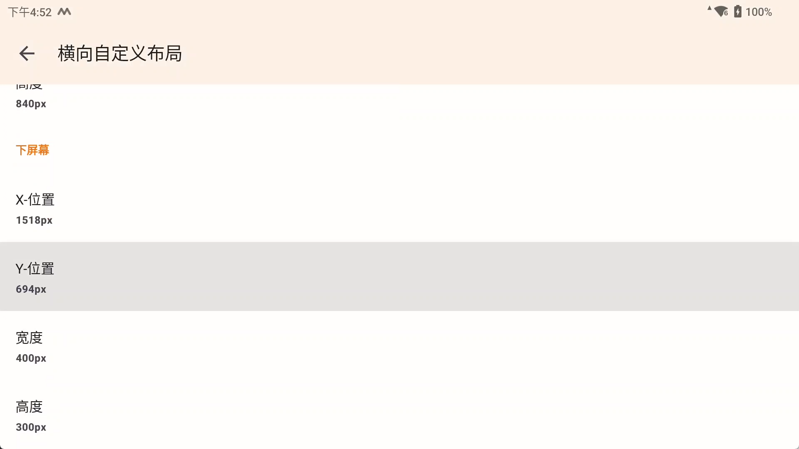

# 遮罩

扩展遮罩功能支持

## 配置路径

| 软件                        | 配置文件夹                                                                    |
|---------------------------|--------------------------------------------------------------------------|
| [Winlator](Winlator.md)   | /storage/emulated/0/Android/data/com.winlator/files/overlay              |
| [NetherSX2](NetherSX2.md) | /storage/emulated/0/Android/data/xyz.aethersx2.android/files/overlay     |
| [Dolphin](Dolphin.md)     | /storage/emulated/0/Android/data/org.dolphinemu.dolphinemu/files/overlay |
| [Joiplay](JoiPlay.md)     | /storage/emulated/0/JoiPlay/overlay                                      |
| [AopAop](AopAop.md)       | /storage/emulated/0/Android/data/com.aopaop.app/files/overlay            |
| [Azahar](Azahar.md)       | /storage/emulated/0/Android/data/io.github.lime3ds.android/files/overlay |
| [Exagear](Exagear.md)     | /storage/emulated/0/Android/data/com.ludashi.benchmara/files/overlay     |

### 关于Azahar的特殊说明

因为要支持Azahar的布局切换，Azahar配置目录下有一层布局文件夹，目前只支持了横向布局

|      文件夹      |  布局   |
|:-------------:|:-----:|
|   original    |  原始   |
| single_screen | 单个屏幕  |
| large_screen  |  大屏幕  |
|  side_screen  | 并排屏幕  |
| hybrid_screen | 混合式屏幕 |
| custom_layout | 自定义布局 |

在 `/storage/emulated/0/Android/data/io.github.lime3ds.android/files/overlay`
文件夹下有以上6个布局文件夹，在每个文件夹下按下面教程 [配置方法](#配置方法) 配置

在 `/storage/emulated/0/Android/data/io.github.lime3ds.android/files/overlay/custom_layout`
中的遮罩图，添加同名的ini文件,配置如下
```ini
LANDSCAPE_TOP_X=46
LANDSCAPE_TOP_Y=144
LANDSCAPE_TOP_WIDTH=1420
LANDSCAPE_TOP_HEIGHT=840
LANDSCAPE_BOTTOM_X=1518
LANDSCAPE_BOTTOM_Y=694
LANDSCAPE_BOTTOM_WIDTH=400
LANDSCAPE_BOTTOM_HEIGHT=300
```
对应软件内的自定义布局设置，这样实现多个自定义布局设置



## 配置名称

关于下面游戏名称的定义说明，在不同的软件中含义不同

| 软件        | 名称定义               |
|-----------|--------------------|
| Winlator  | 软件内快捷方式名称（可在软件内修改） |
| Joiplay   | 软件内游戏名称（可在软件内修改）   |
| AopAop    | 软件内游戏名称（可在软件内修改）   |
| NetherSX2 | rom文件名称（不含后缀）      |
| Dolphin   | rom文件名称（不含后缀）      |
| Azahar    | rom文件名称（不含后缀）      |
| Exagear   | 软件内快捷方式文件名称        |

## 配置方法

文件夹结构


按需求在文件夹内添加对应的文件完成设置

以下三种配置的优先级为 `独立配置`>`批量配置`>`全局配置`

### 独立配置

`game`文件夹

game文件夹下放置和名称相同的png

例如这里的`鬼泣4.png`,名称为鬼泣4的游戏会使用这张图作为遮罩图

### 批量配置

`group`文件夹

game文件夹下放置放置相同名称的一张png图片和txt文档，在txt文档中填写游戏名称，一行一个名称

例如这里 `4x3.txt`文件中的名称对应的游戏，会使用`4x3.png`作为遮罩图

### 全局配置

`default.png`

在overlay目录下放置default.png作为全局的遮罩图，该文件不存在即无全局遮罩图

