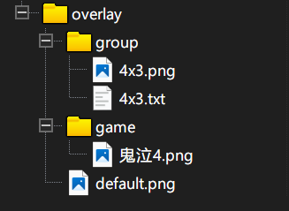

# 遮罩

扩展遮罩功能支持
注意遮罩图片需要png格式，画面显示部分需要为空

## 配置路径

| 软件                        | 配置文件夹                                                                           |
|---------------------------|---------------------------------------------------------------------------------|
| [Winlator](Winlator.md)   | /storage/emulated/0/Android/data/com.winlator/files/overlay                     |
| [NetherSX2](NetherSX2.md) | /storage/emulated/0/Android/data/xyz.aethersx2.android/files/overlay            |
| [Dolphin](Dolphin.md)     | /storage/emulated/0/Android/data/org.dolphinemu.dolphinemu/files/overlay        |
| [Joiplay](JoiPlay.md)     | /storage/emulated/0/JoiPlay/overlay                                             |
| [AopAop](AopAop.md)       | /storage/emulated/0/Android/data/com.aopaop.app/files/overlay                   |
| [Azahar](Azahar.md)       | /storage/emulated/0/Android/data/io.github.lime3ds.android/files/overlay        |
| [Exagear](Exagear.md)     | /storage/emulated/0/Android/data/com.ludashi.benchmara/files/overlay            |
| [M64Plus FZ Pro](M64.md)  | /storage/emulated/0/Android/data/org.mupen64plusae.v3.fzurita.pro/files/overlay |

## 配置名称

关于下面游戏名称的定义说明，在不同的软件中含义不同

| 软件             | 名称定义               |
|----------------|--------------------|
| Winlator       | 软件内快捷方式名称（可在软件内修改） |
| Joiplay        | 软件内游戏名称（可在软件内修改）   |
| AopAop         | 软件内游戏名称（可在软件内修改）   |
| NetherSX2      | rom文件名称（不含后缀）      |
| Dolphin        | rom文件名称（不含后缀）      |
| Azahar         | rom文件名称（不含后缀）      |
| M64Plus FZ Pro | rom文件名称（不含后缀）      |
| Exagear        | 软件内快捷方式文件名称        |

[Exagear名称修改](Exagear.md#exagear名称修改)

## 配置方法

文件夹结构



按需求在文件夹内添加对应的文件完成设置

以下三种配置的优先级为 `独立配置`>`批量配置`>`全局配置`

### 独立配置

`game`文件夹

game文件夹下放置和名称相同的png

例如这里的`鬼泣4.png`,名称为鬼泣4的游戏会使用这张图作为遮罩图

### 批量配置

`group`文件夹

game文件夹下放置放置相同名称的一张png图片和txt文档，在txt文档中填写游戏名称，一行一个名称

例如这里 `4x3.txt`文件中的名称对应的游戏，会使用`4x3.png`作为遮罩图

### 全局配置

`default.png`

在overlay目录下放置default.png作为全局的遮罩图，该文件不存在即无全局遮罩图

## 布局调整

| 软件             | 布局支持 |
|----------------|------|
| Winlator       | 支持   |
| Joiplay        | 支持   |
| AopAop         | 支持   |
| NetherSX2      | 支持   |
| Dolphin        | 支持   |
| Azahar         | 支持   |
| M64Plus FZ Pro | 不支持  |
| Exagear        | 不支持  |

[Azahar特殊说明](Azahar.md#azahar的特殊说明)

在遮罩图片同文件夹里添加同名的`ini`文件，文件内容如下，对应每条边距离屏幕边界的像素

这里一定要注意遮罩图片和配置的对应，游戏画面的比例也要对应

这里的布局调整其实调整的是视图位置，并不是直接修改的游戏画面比例，所以遮罩的配置里一定要注意画面比例

例如下面的配置，只配置上下来实现调整布局

```properties
LEFT=0
TOP=31
RIGHT=0
BOTTOM=31
```

