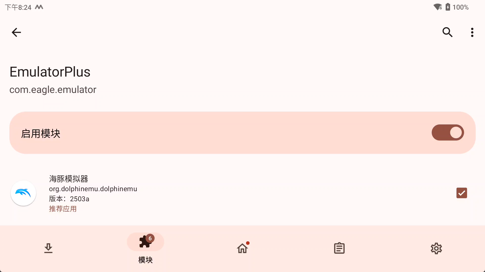
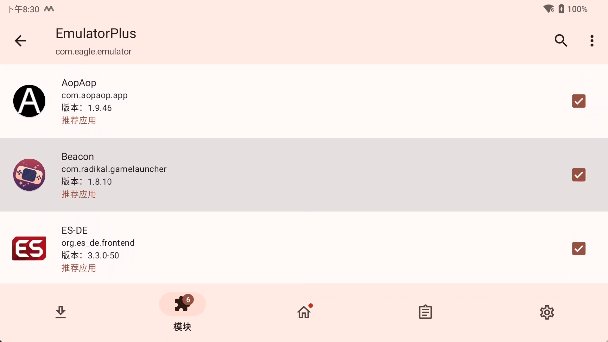

# Root方案

前提条件 机器root并安装 LSPosed

以下是需要的工具

[SukiSU](https://github.com/SukiSU-Ultra/SukiSU-Ultra)

[LSPosed](https://github.com/JingMatrix/LSPosed)

[ZygiskNext](https://github.com/Dr-TSNG/ZygiskNext/)

关于 ***Root***，***SukiSU***，***LSPosed*** 具体教程网上搜索

## LSPosed 模块设置

安装本软件 EmulatorPlus，并且在lsposed中勾选要hook的应用

